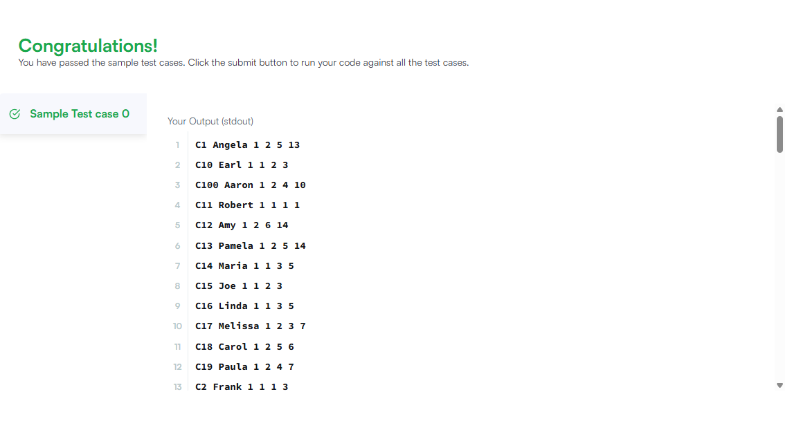

# 📊 New Companies SQL Problem

This repository contains my solution to the **New Companies SQL Problem From HAckerRank**. The scenario involves a conglomerate corporation (Amber Corp) acquiring several companies, each with a predefined multi-level hierarchy of employees.

## 📁 Problem Statement

Amber's conglomerate just acquired new companies. Each company follows this hierarchy:

```
Lead Manager → Senior Manager → Manager → Employee
```

Given the structure, the goal is to write a query to return:

- `company_code`
- `founder` name
- total number of **lead managers**
- total number of **senior managers**
- total number of **managers**
- total number of **employees**

All data should be grouped by company and ordered by `company_code` **alphabetically**, not numerically (e.g., `C_1`, `C_10`, `C_2` → correct order: `C_1`, `C_10`, `C_2`).

## 🧾 Table Schemas

The input tables are:

### `Company`

| Column         | Type    |
|----------------|---------|
| company_code   | String  |
| founder        | String  |

### `Lead_Manager`

| Column         | Type    |
|----------------|---------|
| lead_manager_code | String  |
| company_code   | String  |

### `Senior_Manager`

| Column            | Type    |
|-------------------|---------|
| senior_manager_code | String  |
| lead_manager_code | String  |
| company_code      | String  |

### `Manager`

| Column            | Type    |
|-------------------|---------|
| manager_code      | String  |
| senior_manager_code | String  |
| lead_manager_code | String  |
| company_code      | String  |

### `Employee`

| Column            | Type    |
|-------------------|---------|
| employee_code     | String  |
| manager_code      | String  |
| senior_manager_code | String  |
| lead_manager_code | String  |
| company_code      | String  |

## 💡 Solution 
/*
Enter your query here.
*/
SELECT Company.company_code, Company.founder, COUNT(DISTINCT Employee.lead_manager_code) AS total_number_of_lead_managers, 
COUNT(DISTINCT Employee.senior_manager_code) AS total_number_of_senior_managers, COUNT(DISTINCT Employee.manager_code) AS total_number_of_managers, 
COUNT(DISTINCT Employee.employee_code) AS total_number_of_employees  
FROM Company 
INNER JOIN  Employee ON Company.company_code = Employee.company_code
GROUP BY Company.company_code, Company.founder
ORDER BY company_code ASC


## ✅ Output

